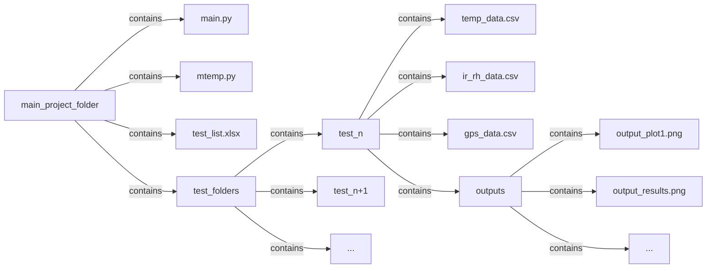

# M-Temp Data Processing and Analysis Program

## Overview

The **M-Temp Data Processing Module** is a Python script designed to handle and process M-Temp data efficiently. This module provides a suite of functions for loading, cleaning, converting, and visualizing temperature, IR/RH, and GPS data. It is intended to be interacted with at the command line through the `main.py` script.

## Table of Contents

- [Features](#features)
- [Installation](#installation)
- [Usage](#usage)
  - [Using The Script](#using-the-script)
  - [Using The Excel Sheet](#using-the-excel-sheet)
- [Directory Structure](#directory-structure)
- [Functions](#functions)
  - [Loading Data](#loading-data)
  - [Data Conversion](#data-conversion)
  - [Spatial Data Handling](#spatial-data-handling)
  - [Visualization](#visualization)
- [Cart Configuration](#cart-configuration)
- [Ideas for Future Development](#ideas-for-future-development)
- [Author](#author)
- [License](#license)

## Features

- **Data Loading**: Efficiently load and clean temperature, IR/RH, and GPS data from Excel and CSV files.
- **Data Conversion**: Convert temperature from Celsius to Fahrenheit, raw IR voltage to temperature, and raw RH voltage to relative humidity percentages.
- **Spatial Data Handling**: Merge sensor data with GPS data to create geospatial datasets.
- **Visualization**: Generate time series plots, scatter plots, and heatmaps for comprehensive data analysis.
- **Configuration Management**: Easily manage different sensor configurations for multiple carts.

## Installation

Ensure you have Python 3.7 or higher installed. You can install the required dependencies found with the included requirements.txt file by using `pip`:

```{bash}
pip install -r requirements.txt
```

## Usage

### Using The Script

From the command line you can invoke `main.py` to begin the script to process M-Temp data.

```bash
python main.py
```

You then will be presented with an interface within the program where you will simply input an integer that refers to the test you would like to work with. You then will have other prompts to do specific operations with the data from that test.

More to come soon on how to interact and use.

Here’s a revised version of the section that improves clarity and presentation:

### Using The Excel Sheet

To ensure the script functions correctly, the included Excel sheet must be up-to-date and accurately filled out for each test. The script depends on the information in each column being accurate so that the only interaction you need to have is through inputting the test number. The Excel sheet consists of 11 columns, each with specific requirements:

| Column Name               | Requirements                                                         |
|---------------------------|----------------------------------------------------------------------|
| **Test Number**           | Must be an integer.                                                 |
| **Test Folder**           | Should be written as a string; ensure it is enclosed in quotes.    |
| **Temperature Data**      | Should be written as a string; ensure it is enclosed in quotes.    |
| **IR/RH Data**            | Should be written as a string; ensure it is enclosed in quotes.    |
| **GPS Data**              | Should be written as a string; ensure it is enclosed in quotes.    |
| **Test Date**             | Valid date format, stay consistent.                                                 |
| **Testing Route**         | Description of the testing route.                                  |
| **Cart**                  | Name or description of the cart used.                              |
| **Set Up**                | Description of the wiring setup process.                                  |
| **Temperature Configuration** | Should be written as a string; ensure it is enclosed in quotes.    |
| **IR/RH Configuration**   | Should be written as a string; ensure it is enclosed in quotes.    |

**Note:** All columns must be filled out properly. If there is no data or information available for a column, please input `None`.

## Directory Structure

The raw data and outputs are organized in a structured directory layout to facilitate easy access and management. The scipt also hinges on this structure being used.



### Explanation of Key Files and Folders

- **main.py**: The primary script that utilizes the `mtemp` module for data processing.
- **mtemp.py**: The M-Temp Data Processing Module containing all necessary functions.
- **test_list.xlsx**: Excel file containing references to all tests, where their data is stored, and their configurations.
- **/test_folders/**: Directory containing individual test data folders.
  - **/test_n/**: Folder for a specific test containing raw data and outputs.
    - **temp_data.csv**: Temperature DAQ data.
    - **ir_rh_data.csv**: IR/RH DAQ data.
    - **gps_data.csv**: GPS data.
    - **/outputs/**: Directory for generated plots and results.

## Functions

### Loading Data

#### `load_excelsheet()`

Loads the Excel reference sheet and converts it into a dictionary for easy access to file paths and configurations.

- **Parameters**:
  - `filepath`: Path to the Excel file containing test information.
- **Returns**: A dictionary with test numbers as keys and associated information as values.

#### `define_output_folder()`

Prompts the user to select an output folder for saving generated plots.

- **Parameters**:
  - `folderpath`: Default path to the output folder.
- **Returns**: The path to the selected output folder.

#### `load_temp_daq()`

Loads and cleans temperature DAQ data based on the test number.

- **Parameters**:
  - `test_num`: The test number associated with the desired temperature data.
- **Returns**: A pandas DataFrame containing temperature data.

#### `load_ir_daq()`

Loads and cleans IR/RH DAQ data based on the test number.

- **Parameters**:
  - `test_num`: The test number associated with the desired IR/RH data.
- **Returns**: A pandas DataFrame containing IR/RH data.

#### `load_gps()`

Loads and cleans GPS data based on the test number.

- **Parameters**:
  - `test_num`: The test number associated with the desired GPS data.
- **Returns**: A pandas DataFrame containing GPS data.

### Data Conversion

#### `convertCtoF()`

Converts a temperature column from Celsius to Fahrenheit.

- **Parameters**:
  - `ccolumn`: Pandas Series containing temperature data in Celsius.
- **Returns**: Pandas Series with temperature data in Fahrenheit.

#### `convertVtoIR()`

Calculates temperature in Fahrenheit from raw IR voltage data.

- **Parameters**:
  - `vcolumn`: Pandas Series containing raw IR voltage data.
- **Returns**: Pandas Series with temperature data in Fahrenheit.

#### `convertVtoRH()`

Calculates Relative Humidity (%) from raw RH voltage and temperature data.

- **Parameters**:
  - `rhvcolumn`: Pandas Series containing raw RH voltage data.
  - `tempcolumn`: Pandas Series containing temperature data in Celsius.
- **Returns**: Pandas Series with calculated Relative Humidity percentages.

### Spatial Data Handling

#### `spatially_enable_data()`

Merges sensor data with GPS data to create a GeoDataFrame with spatial information.

- **Parameters**:
  - `sensordf`: DataFrame containing sensor data.
  - `gpsdf`: DataFrame containing GPS data.
- **Returns**: GeoPandas GeoDataFrame with spatially enabled sensor data.

### Visualization

#### `timeseries()`

Generates a time series plot for temperature, IR, and/or RH data.

- **Parameters**:
  - `dataframe`: DataFrame or GeoDataFrame containing the data to plot.
  - `temp`: Include temperature data. Default True.
  - `ir`: Include IR data. Default False.
  - `rh`: Include RH data. Default False.
  - `b`: Include 'b' sensors. Default True.
  - `ymax`: Maximum y-axis limit as a float or integer. Default None.
  - `ymin`: Minimum y-axis limit as a float or integer. Default None.
  - `starttime`: Start time for the plot as a Pandas Timestamp. Default None.
  - `endtime`: End time for the plot as a Pandas Timestamp. Default None.
- **Returns**: Matplotlib Figure object with the time series plot.

#### `scatter_plot()`

Generates a scatter plot between two data columns.

- **Parameters**:
  - `column1`: First data column.
  - `column2`: Second data column.
- **Returns**: Matplotlib Figure object with the scatter plot.

#### `make_heatmap()`

Generates a heatmap from geospatial data.

- **Parameters**:
  - `gdf`: GeoDataFrame containing the spatial data.
  - `cell_size`: Size, in meters, of each cell in the heatmap as an integer. Default 10.
  - `interpolate`: Whether to interpolate the heatmap. Default False.
- **Returns**: Matplotlib Figure object with the heatmap.

#### `vertical_heatmap()`

Generates a vertical heatmap from the data.

- **Parameters**:
  - `df`: DataFrame or GeoDataFrame containing the data.
  - `ir`: Include IR data. Default False.
  - `to_height`: Height parameter, in feet, for the heatmap as a float or integer. Default 10.8.
- **Returns**: Matplotlib Figure object with the vertical heatmap.

## Cart Configuration

The module includes predefined configurations for different sensor carts. These configurations map sensor channels to their respective physical positions and measurement units.

```python
configs = {
    "Cart 1 Temp": {'AI0 (°C)': '1.8 ft (°C)',
                'AI1 (°C)': '5.4 ft (°C)',
                'AI2 (°C)': '0.6 ft (°C)',
                'AI3 (°C)': '3.6 ft (°C)',
                'AI4 (°C)': '7.2 ft (°C)',
                'AI5 (°C)': '9.0 ft (°C)',
                'AI6 (°C)': '3.6 ft b (°C)' ,
                'AI7 (°C)': '5.4 ft b (°C)'
                },

    "Cart 1 IR": {'AI0 (V)':'IR Raw'},

    "Cart 2 Temp": {'AI2 (°C)': '1.8 ft (°C)',
                'AI1 (°C)': '0.6 ft (°C)',
                'AI3 (°C)': '3.6 ft (°C)',
                'AI4 (°C)': '3.6 ft b (°C)',
                'AI0 (°C)': '5.4 ft (°C)',
                'AI5 (°C)': '5.4 ft b (°C)',
                'AI6 (°C)': '7.2 ft (°C)' ,
                'AI7 (°C)': '9.0 ft (°C)'
                },

    "Cart 2 IR": {'AI0 (V)':'IR Raw',
                  'AI1 (V)':'RH 0.0ft',
                  'AI3 (V)':'RH 1.8ft',
                  'AI2 (V)':'RH 7.2ft',
                  'AI4 (V)':'RH 9.0ft'}

}
```

## Ideas for Future Development

- **Subset DataFrame Generation**: Implement a function to generate a subset of the DataFrame based on user-specified columns.
- **Enhanced Visualization**: Add more visualization options and enhance current options.
- **Data Validation**: Incorporate data validation checks to ensure data integrity before processing.

## Author

**M-TEMP Team**

_Last Updated: October 15, 2024_

## License

[MIT License](LICENSE)

---