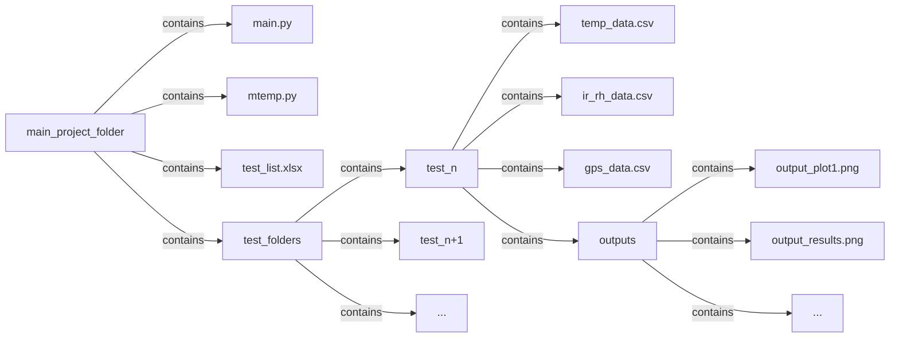

# M-TEMP Data Processing and Analysis Program

## Overview

The **M-TEMP Data Processing And Analysis Programe Module** is a Python script designed to handle and process data from the University of Chicago mobile temperature measurement system (M-TEMP) efficiently. This module provides a suite of functions for loading, cleaning, converting, and visualizing temperature, IR/RH, and GPS data. It is intended to be interacted with at the command line through the `main.py` script.

## Table of Contents

- [Features](#features)
- [Installation](#installation)
- [Usage](#usage)
  - [Using The Script](#using-the-script)
  - [Using The Excel Sheet](#using-the-excel-sheet)
- [Directory Structure](#directory-structure)
- [Functions](#functions)
  - [Loading Data](#loading-data)
    - [`load_excelsheet()`](#load_excelsheet)
    - [`define_output_folder()`](#define_output_folder)
    - [`load_temp_daq()`](#load_temp_daq)
    - [`load_ir_daq()`](#load_ir_daq)
    - [`load_gps()`](#load_gps)
  - [Data Conversion](#data-conversion)
    - [`convertCtoF()`](#convertctoF)
    - [`convertVtoIR()`](#convertvtoir)
    - [`convertVtoRH()`](#convertvtorh)
  - [Data Merging](#data-merging)
    - [`merge_sensors()`](#merge_sensors)
  - [Spatial Data Handling](#spatial-data-handling)
    - [`spatially_enable_data()`](#spatially_enable_data)
  - [Visualization](#visualization)
    - [`timeseries()`](#timeseries)
    - [`scatter_plot()`](#scatter_plot)
    - [`make_heatmap()`](#make_heatmap)
    - [`vertical_heatmap()`](#vertical_heatmap)
- [Cart Configuration](#cart-configuration)
- [Ideas for Future Development](#ideas-for-future-development)
- [Author](#author)
- [License](#license)

## Features

- **Data Loading**: Efficiently load and clean temperature, IR/RH, and GPS data from Excel and CSV files.
- **Data Conversion**: Convert temperature from Celsius to Fahrenheit, raw IR voltage to temperature, and raw RH voltage to relative humidity percentages.
- **Data Merging**: Merge different sensor data together to create more extensive datasets.
- **Spatial Data Handling**: Merge sensor data with GPS data to create geospatial datasets.
- **Visualization**: Generate time series plots, scatter plots, and heatmaps for comprehensive data analysis.
- **Configuration Management**: Easily manage different sensor configurations for multiple carts.

## Installation

Ensure you have Python 3.7 or higher installed. You can install the required dependencies found with the included requirements.txt file by using `pip`:

```{bash}
pip install -r requirements.txt
```

## Usage

### Using The Script

From the command line you can invoke `main.py` to begin the script to process M-Temp data.

```bash
python main.py
```

You then will be presented with an interface within the program where you will simply input an integer that refers to the test you would like to work with. You then will have other prompts to do specific operations with the data from that test.

More to come soon on how to interact and use.

### Using The Excel Sheet

To ensure the script functions correctly, the included Excel sheet must be up-to-date and accurately filled out for each test. The script depends on the information in each column being accurate so that the only interaction you need to have is through inputting the test number. The Excel sheet consists of 11 columns, each with specific requirements:

| Column Name               | Requirements                                                         |
|---------------------------|----------------------------------------------------------------------|
| **Test Number**           | Must be an integer.                                                 |
| **Test Folder**           | Should be written as plain text    |
| **Temperature Data**      | Should be written as plain text    |
| **IR/RH Data**            | Should be written as plain text    |
| **GPS Data**              | Should be written as plain text    |
| **Test Date**             | Valid date format, stay consistent.                                                 |
| **Testing Route**         | Description of the testing route.                                  |
| **Cart**                  | Name or description of the cart used.                              |
| **Set Up**                | Description of the wiring setup process.                                  |
| **Temperature Configuration** | Should be written in plain text    |
| **IR/RH Configuration**   | Should be written in plain text    |

**Note:** All columns must be filled out properly. If there is no data or information available for a column, please input `None`.

## Directory Structure

The raw data and outputs are organized in a structured directory layout to facilitate easy access and management. The scipt also hinges on this structure being used.



### Explanation of Key Files and Folders

- **main.py**: The primary script that utilizes the `mtemp` module for data processing.
- **mtemp.py**: The M-Temp Data Processing Module containing all necessary functions.
- **test_list.xlsx**: Excel file containing references to all tests, where their data is stored, and their configurations.
- **/test_folders/**: Directory containing individual test data folders.
  - **/test_n/**: Folder for a specific test containing raw data and outputs.
    - **temp_data.csv**: Temperature DAQ data.
    - **ir_rh_data.csv**: IR/RH DAQ data.
    - **gps_data.csv**: GPS data.
    - **/outputs/**: Directory for generated plots and results.

## Functions

### Loading Data

#### `load_excelsheet()`

Automatically loads the Excel reference sheet and converts it into a dictionary for easy access to file paths, configurations, and test-related information. The dictionary uses test numbers as keys and their associated data, including folder paths, temperature data, IR/RH data, GPS data, and more, as a list values. This function should be run at program start to ensure all data-loading functions can access the necessary file paths.

- **Parameters**:
  - None
- **Returns**:
  - `dict[int, list[str | int]]`A dictionary with test numbers as keys and associated lists of relevant information as values, such as file paths and configurations.

#### `define_output_folder()`

Automatically finds or creates the output folder for the specified test number. The function uses the test number to locate the associated test folder and ensures an 'outputs' subdirectory is created if it doesn't already exist.

- **Parameters**:
  - `test_dict` (`int`): Dictionary containing test information loaded from the Excel sheet.
  - `test_number` (`dict[int, list[str | int]]`): The test number for which the output folder path is needed.
- **Returns**:
  - `str`: The path to the output folder for the specified test number.

#### `load_temp_daq()`

Loads, cleans, and returns the temperature DAQ data as a pandas DataFrame based on the given test number. It uses the test folder and temperature data path stored in the Excel reference sheet. The function formats timestamps, renames columns according to configuration, and selects relevant temperature columns for analysis.

- **Parameters**:
  - `test_num` (`int`): The test number associated with the desired temperature data.
  - `tests_dict` (`dict[int, list[str | int]]`): Dictionary containing test information loaded from the Excel sheet.
- **Returns**:
  - `pd.DataFrame`: A pandas DataFrame containing the cleaned temperature data, with the appropriate columns renamed and formatted for analysis.

#### `load_ir_daq()`

Loads and cleans IR/RH DAQ data based on the test number.

- **Parameters**:
  - `test_num` (`int`): The test number associated with the desired IR/RH data.
  - `tests_dict` (`dict[int, list[str | int]]`): Dictionary containing test information, including file paths and configurations.

- **Returns**:
  - `pd.DataFrame`: A pandas DataFrame containing the cleaned IR/RH data with timestamps set as the index.

#### `load_gps()`

Loads and cleans GPS data based on the test number.

- **Parameters**:
  - `test_num` (`int`): The test number associated with the desired GPS data.
  - `tests_dict` (`dict[int, list[str | int]]`): Dictionary containing test information, including file paths and configurations.

- **Returns**:
  - `pd.DataFrame`: A pandas DataFrame containing the cleaned GPS data with timestamps set as the index.

### Data Conversion

#### `convertCtoF()`

Converts temperature columns from Celsius to Fahrenheit within a (Geo)DataFrame.

- **Parameters**:
  - `cdfcol` (`pd.DataFrame` | `gpd.GeoDataFrame`): The DataFrame containing temperature data in Celsius.

- **Returns**:
  - `pd.DataFrame` | `gpd.GeoDataFrame`: The original DataFrame with new columns added for temperatures in Fahrenheit.

#### `convertVtoIR()`

Calculates temperature in Fahrenheit from raw IR voltage data.

- **Parameters**:
  - `virdfcol` (`pd.DataFrame` | `gpd.GeoDataFrame`): The DataFrame containing raw IR voltage data.

- **Returns**:
  - `pd.DataFrame` | `gpd.GeoDataFrame`: The original DataFrame with new columns added for IR temperatures in Fahrenheit.

#### `convertVtoRH()`

Calculates Relative Humidity (%) from raw RH voltage and associated temperature data.

- **Parameters**:
  - `rhdfcol` (`pd.DataFrame` | `gpd.GeoDataFrame`): The DataFrame containing raw RH voltage data and associated temperature data.

- **Returns**:
  - `pd.DataFrame` | `gpd.GeoDataFrame`: The original DataFrame with new columns added for calculated Relative Humidity percentages.

### Data Merging

#### `merge_sensors()`

Merges the temperature and IR/RH DataFrames using their indices.

- **Parameters**:
  - `sensordf` (`pd.DataFrame`): The temperature DataFrame to merge.
  - `irrhdf` (`pd.DataFrame`): The IR/RH DataFrame to merge.

- **Returns**:
  - `pd.DataFrame`: A pandas DataFrame containing the merged data from both sensors.

### Spatial Data Handling

#### `spatially_enable_data()`

Merges sensor data with GPS data to create a GeoDataFrame with spatial information. Optionally includes IR/RH data.

- **Parameters**:
  - `sensordf` (`pd.DataFrame`): DataFrame containing sensor data.
  - `gpsdf` (`pd.DataFrame`): DataFrame containing GPS data.
  - `irrhdf` (`pd.DataFrame` | `None`, optional): DataFrame containing IR/RH data. Defaults to `None`.

- **Returns**:
  - `gpd.GeoDataFrame`: A GeoDataFrame with spatially enabled sensor data, transformed to EPSG:3857 CRS.

### Visualization

#### `timeseries()`

Generates a time series plot for temperature, IR, and/or RH data.

- **Parameters**:
  - `output_folder` (str): Path where the plot will be saved.
  - `dataframe` (`pd.DataFrame` | `gpd.GeoDataFrame`): The DataFrame containing the data to plot.
  - `temp` (bool, optional): Include temperature data. Default is `True`.
  - `ir` (bool, optional): Include IR data. Default is `False`.
  - `rh` (bool, optional): Include RH data. Default is `False`.
  - `b` (bool, optional): Include 'b' sensors with dashed lines. Default is `True`.
  - `yminmax` (`tuple[int | float, int | float]` | `None`, optional): Tuple specifying the y-axis limits. Default is `None`.
  - `timeframe` (`tuple[pd.Timestamp, pd.Timestamp]` | `None`, optional): Tuple specifying the start and end times for the plot. Default is `None`.

- **Returns**:
  - `plt.Figure`: The generated time series plot.

#### `dot_map()`

Generates a map with each data point plotted, primarily used to verify correct GPS merging and spatial enabling.

- **Parameters**:
  - `gdf` (`gpd.GeoDataFrame`): GeoDataFrame containing all relevant sensor and GPS data.
  - `output_folder` (str): Path where the plot will be saved.

- **Returns**:
  - `plt.Figure`: The generated dot map plot.

#### `scatter_plot()`

Generates a scatter plot between two data columns, with an optional third column for color-coding.

- **Parameters**:
  - `column1` (`pd.Series` | `gpd.GeoSeries`): First data column to plot on the x-axis.
  - `column2` (`pd.Series` | `gpd.GeoSeries`): Second data column to plot on the y-axis.
  - `output_folder` (str): Path where the plot will be saved.
  - `column3` (`pd.Series` | `gpd.GeoSeries` | `None`, optional): Third data column for color-coding the points. Defaults to `None`.
  - `cmap` (str, optional): Colormap for color-coding. Default is `'viridis'`.

- **Returns**:
  - `plt.Figure`: The generated scatter plot.

#### `make_heatmap()`

Generates a heatmap from geospatial data based on specified units and cell size. Supports optional interpolation.

- **Parameters**:
  - `gdf` (`gpd.GeoDataFrame`): GeoDataFrame containing the spatial data.
  - `output_folder` (str): Path where the heatmap images will be saved.
  - `units` (str, optional): Units for the heatmap. Acceptable values are `'ft (°F)'`, `'C'`, and `'RH (%)'`. Default is `'ft (°F)'`.
  - `cell_size` (int, optional): Size of each cell in meters. Default is `10`.
  - `interpolate` (bool, optional): Whether to interpolate the heatmap. Default is `False`.

- **Returns**:
  - `plt.Figure`: The generated heatmap plot.

#### `vertical_heatmap()`

Generates a vertical heatmap from the data, displaying temperature, IR, and/or RH across different heights.

- **Parameters**:
  - `df` (`pd.DataFrame` | `gpd.GeoDataFrame`): The DataFrame containing the data to plot.
  - `output_folder` (str): Path where the vertical heatmap image will be saved.
  - `temp` (bool, optional): Include temperature data. Default is `True`.
  - `ir` (bool, optional): Include IR data. Default is `False`.
  - `rh` (bool, optional): Include RH data. Default is `False`.
  - `to_height` (`int` | `float`, optional): The height of the top sensor plus the interval between all sensors. Default is `10.8`.

- **Returns**:
  - `plt.Figure`: The generated vertical heatmap plot.

## Cart Configuration

The module includes predefined configurations for different sensor carts. These configurations map sensor channels to their respective physical positions and measurement units.

```python
configs = {
    "Cart 1 Temp": {'AI0 (°C)': '1.8 ft (°C)',
                'AI1 (°C)': '5.4 ft (°C)',
                'AI2 (°C)': '0.6 ft (°C)',
                'AI3 (°C)': '3.6 ft (°C)',
                'AI4 (°C)': '7.2 ft (°C)',
                'AI5 (°C)': '9.0 ft (°C)',
                'AI6 (°C)': '3.6 ft b (°C)' ,
                'AI7 (°C)': '5.4 ft b (°C)'
                },

    "Cart 1 IR": {'AI0 (V)':'IR Raw (V)'},

    "Cart 2 Temp": {'AI2 (°C)': '1.8 ft (°C)',
                'AI1 (°C)': '0.6 ft (°C)',
                'AI3 (°C)': '3.6 ft (°C)',
                'AI4 (°C)': '3.6 ft b (°C)',
                'AI0 (°C)': '5.4 ft (°C)',
                'AI5 (°C)': '5.4 ft b (°C)',
                'AI6 (°C)': '7.2 ft (°C)' ,
                'AI7 (°C)': '9.0 ft (°C)'
                },

    "Cart 2 IR": {'AI0 (V)':'IR Raw (V)',
                  'AI1 (V)':'Raw RH 0.0ft',
                  'AI3 (V)':'Raw RH 1.8ft',
                  'AI2 (V)':'Raw RH 7.2ft',
                  'AI4 (V)':'Raw RH 9.0ft'}

}
```

## Ideas for Future Development

- **Make Function to Smooth Out IR Data**: Implement a function to smooth out
IR data in some way since it is so erratic.
- **Subset DataFrame Generation**: Implement a function to generate a subset of the DataFrame based on user-specified columns.
- **Enhanced Visualization**: Add more visualization options and enhance current options.
- **Data Validation**: Incorporate data validation checks to ensure data integrity before processing.
- **Make Full GUI**: Incorperating a GUI could make it easier to navigate the
different flags of the plotting functions and could make it easier to visually
subset data.

## Author

**University of Chicago M-TEMP Team**

_Last Updated: October 16, 2024_

## License

[MIT License](LICENSE)

---